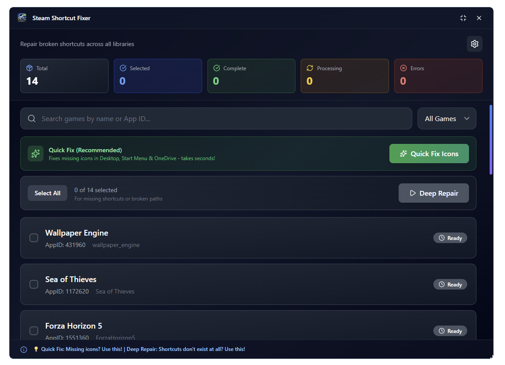

<div align="center">
  <h1>Steam Shortcut Fixer</h1>
  <a href="https://github.com/XeTrinityz/Steam-Shortcut-Fixer/releases">
    
  </a>
  <br>
  A modern, fast Tauri + React utility that scans your Steam libraries and <b>repairs missing or broken shortcuts</b>.  
  Fixes missing icons in the Desktop, Start Menu, and OneDrive - and provides a deeper repair option for fully broken installs.
</div>



---

## ✨ Features

### 🔧 Quick Fix
- Repairs missing **Steam game icons**
- Works with:
  - Desktop shortcuts
  - Start Menu shortcuts
  - OneDrive-synced shortcuts

### 🛠️ Deep Repair Mode
Designed for when **shortcuts are completely gone**  
1. Temporarily renames the game folder  
2. Opens Steam to uninstall the entry (you confirm)
3. Restores the original folder name  
4. Opens Steam to reinstall (you confirm)

### 🧭 Other Features
- Custom Steam library path support
- Multi-select / Select All games
- Progress indicators per game
- Real-time toasts (success / warning / error)
- Custom draggable titlebar with minimize & close
- Beautiful animated UI with TailwindCSS

---

## 🖥️ Tech Stack

- ⚡ **Tauri**
- ⚛️ **React**
- 🎨 **TailwindCSS**
- 🧰 **TypeScript**
- 🖼️ **Lucide Icons**

---

## 🚀 Getting Started (Development)

### Prerequisites
- Node.js (LTS recommended)
- Rust toolchain (`rustup`)
- Steam installed

---

### 1. Install dependencies
```bash
npm install
```
### 2. Run in dev mode
```bash
npm run tauri dev
```

